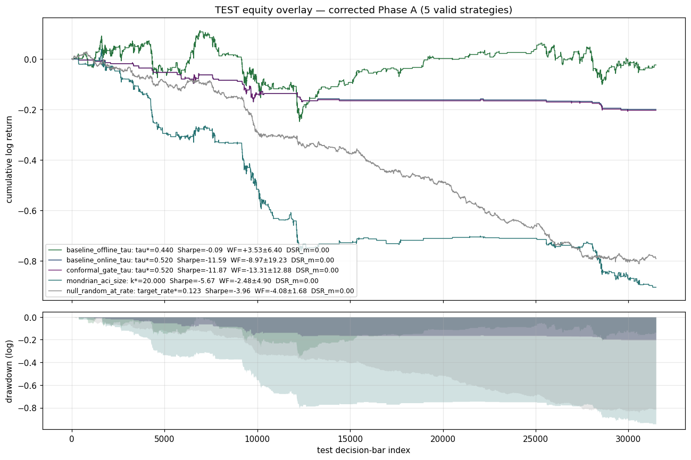
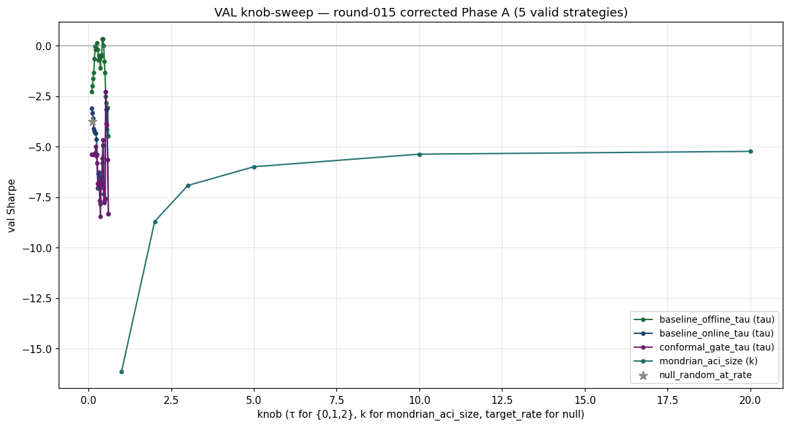
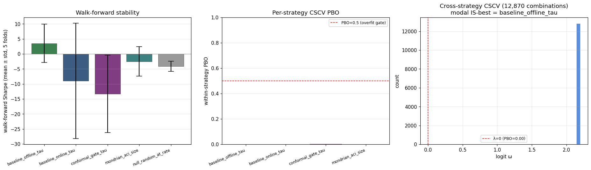
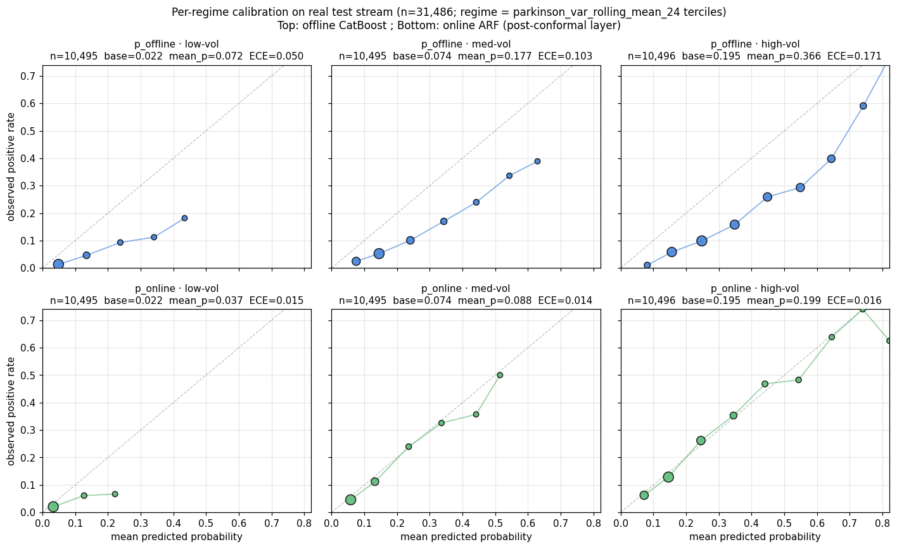
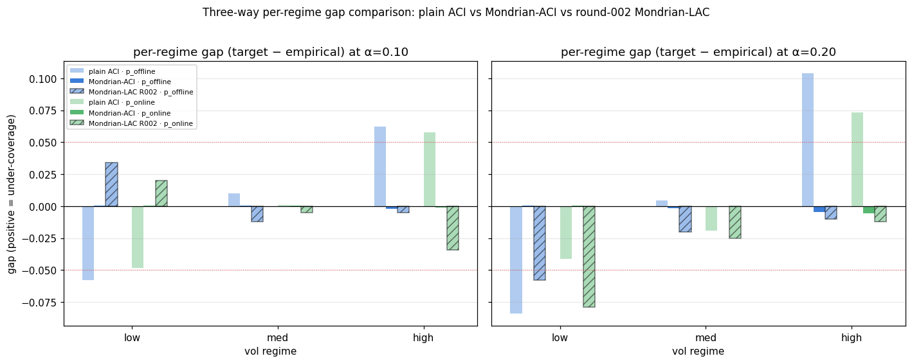
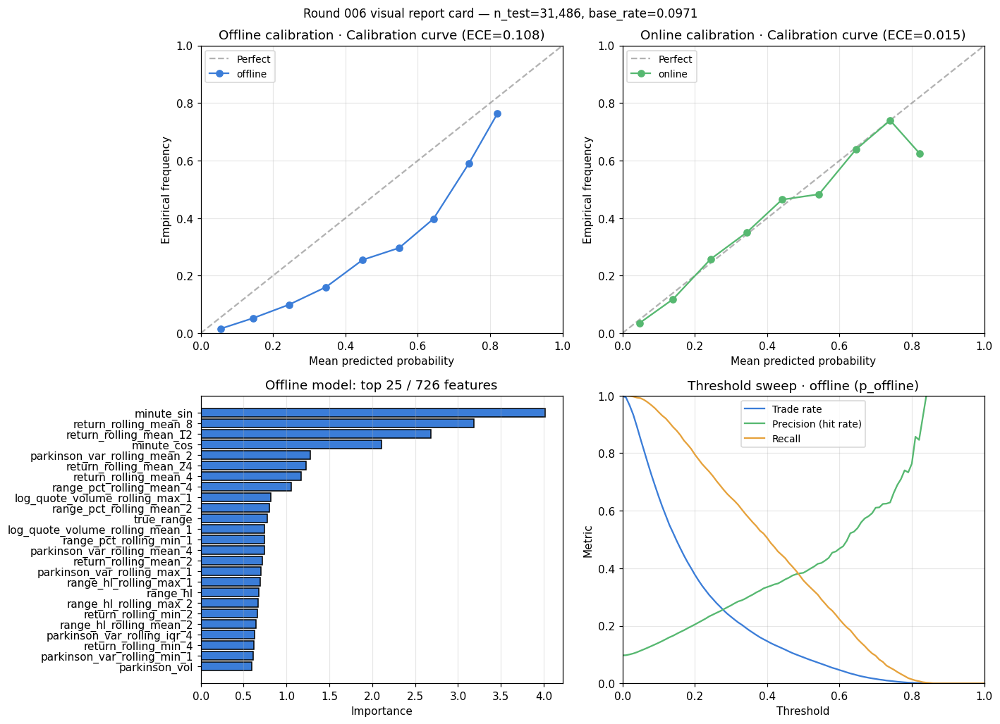

# Online Barrier Classifier — Living Report

_Single source of truth. Regenerated by `scripts/build_report.py` from the
canonical artefacts under `RESEARCH/diagrams/` and `artifacts/phase_A/`.
`REPORT_LATEST.md` no longer exists; this file is the only living dashboard._

---

## ⓪ Architecture (binding — see [CONSTITUTION §0](CONSTITUTION.md#0-project-architecture-snapshot))

`online_barrier_classifier` is a **two-layer hierarchical classifier**:

```
            ┌─ Layer 1 (offline) ─┐    ┌─ Layer 2 (online — system output) ──┐
20m bars ──>│ CatBoost (langevin) │ ──>│ ARFClassifier consumes              │ ──> p_online
            │  → p_offline        │    │ (selected_features + p_offline)     │
            └─────────────────────┘    │ → p_online (calibrated probability) │
                                       └─────────────────────────────────────┘
                                                    │
                                                    ▼
                                       Mondrian-ACI on p_online
                                       → q_t, in_set_α (per-regime conformal coverage)
```

**`p_offline` is INPUT to the online layer; `p_online` is the system OUTPUT.**
Anything that averages or stacks `(p_offline, p_online)` is architecturally
invalid (it regresses the child onto its parent) and is forbidden by the
strategy registry. Anything that drives the conformal layer off `p_offline`
ignores the online correction. Round-015 enforces both constraints; the four
prior rounds that violated them (010 partial, 011, 012, 013 partial) were
deleted under round-015 cleanup and are recorded in [`KILL_LIST.md`](KILL_LIST.md).

## ① Headline (round 015 — corrective Phase A under the two-layer architecture)

**No strategy survives the deflated bar.** The offline layer alone is the
modal IS-best across 12,870 CSCV combinations and still produces test
Sharpe = **−0.089** (below the deflation threshold of `SR* ≈ 8.1` implied
by the 85-trial pooled deflation). Adding the online layer or the conformal
gate strictly destroys value vs offline-alone on this dataset.

| strategy | knob* | val Sharpe | **test Sharpe** | n | p_boot | DSR_multi | WF Sharpe (mean ± std, 5f) | within-PBO |
|---|---|---|---|---|---|---|---|---|
| `baseline_offline_tau` | τ=0.44 | +0.347 | **−0.089** | 3,427 | 0.000 | 0.000 | +3.53 ± 6.40 | 0.000 |
| `baseline_online_tau`  | τ=0.52 | −2.285 | −11.591 | 289 | 1.000 | 0.000 | −8.97 ± 19.23 | 0.001 |
| `conformal_gate_tau`   | τ=0.52 | −2.268 | −11.874 | 288 | 0.735 | 0.000 | −13.31 ± 12.88 | 0.003 |
| `mondrian_aci_size`    | k=20  | −5.237 | −5.666  | 2,372 | 0.505 | 0.000 | −2.48 ± 4.90 | 0.000 |
| `null_random_at_rate`  | r=0.123 | −3.752 | −3.963 | 3,448 | 1.000 | — | −4.08 ± 1.68 | — |

Cost: 1 bp/side. Barriers: φ = c_stop = α = 0.0041113. M = 20-min decision bars.
τ-grid: 26 points {0.10..0.60 step 0.02}. k-grid: {1, 2, 3, 5, 10, 20}.
Multi-strategy DSR: n_trials = 85 pooled (5 strategies × their respective grids), var_trial = 8.359.
Cross-strategy CSCV PBO = 0.000 across 12,870 combinations.

**Equity overlay** (round 015):



**Val knob sweep** (round 015):



**Walk-forward + CSCV PBO panel** (round 015):



## ② Calibration & coverage (these ARE solved; the headline above is unrelated to coverage)

The streaming online layer + Mondrian-ACI achieve regime-conditional coverage
exactly as designed (CONSTITUTION I). The system trades ranking for coverage
on purpose; the trading-edge result above is the cost paid.

**Global metrics** (round 005, on test n = 31,486)

| predictor | ROC | Brier | log loss | ECE |
|---|---|---|---|---|
| p_offline | 0.813 | 0.0903 | 0.3084 | 0.1080 |
| p_online (system output) | 0.799 | 0.0758 | 0.2647 | 0.0147 |

**Per-regime ECE / Brier** (`parkinson_var_rolling_mean_24` terciles)

| predictor | regime | n | base rate | mean p | ECE | Brier |
|---|---|---|---|---|---|---|
| p_offline | low | 10,495 | 0.022 | 0.072 | 0.0497 | 0.0250 |
| p_offline | med | 10,495 | 0.074 | 0.177 | 0.1028 | 0.0773 |
| p_offline | high | 10,496 | 0.195 | 0.366 | 0.1714 | 0.1685 |
| p_online | low | 10,495 | 0.022 | 0.037 | 0.0148 | 0.0221 |
| p_online | med | 10,495 | 0.074 | 0.088 | 0.0144 | 0.0656 |
| p_online | high | 10,496 | 0.195 | 0.199 | 0.0156 | 0.1398 |

**Per-regime calibration curves** (round 005):



**Mondrian-ACI per-regime coverage gap** (round 008 — α=0.20 low-vol p_online
gap closed from −7.9pp to +0.04pp; max gap anywhere ≤ 0.6pp).



## ③ Model

**Top-5 features by offline CatBoost importance** (round 006):

| feature | importance |
|---|---|
| minute_sin | 4.017 |
| return_rolling_mean_8 | 3.188 |
| return_rolling_mean_12 | 2.686 |
| minute_cos | 2.108 |
| parkinson_var_rolling_mean_2 | 1.278 |

**Visual report card** (round 006):



## ④ Loop state

**Accepted tags**: round-001-accepted, round-002-accepted, round-003-accepted,
round-004-accepted, round-005-accepted, round-006-accepted, round-007-accepted,
round-008-accepted, round-009-accepted, round-015-accepted (corrective Phase A;
supersedes 011/012/013).

**Killed rounds** (see [`KILL_LIST.md`](KILL_LIST.md)): round-010 (H-024 in_progress, never accepted),
round-011 (architectural error: combined_avg_tau), round-012 (architectural error:
combined_stacked_tau + Mondrian-ACI on p_offline), round-013 (interrupted by user
redirect to research-planning round 014).

**Round-014** (planning round, infra-only commit): 13 new H-IDs catalogued
(H-301..H-313, H-320-a, H-320-b) under 8 asks; 9 web-only references added
to `RESEARCH/literature/INDEX.md` under new `[STATS-CI]` tag. See
[`RESEARCH/research_plan_round_014.md`](research_plan_round_014.md).

**Next 8 rounds** (per round-014 plan, ordering preserved post-015):

1. **H-024** (no-stop variant): re-run round-015 with `c_stop = ∞` on the
   `simulate_inventory_aware_sized` harness. Cheapest test of label/backtest
   mismatch. Wall ≈ 5 min.
2. **H-320-a** (per-metric bootstrap CI library): unblocks audit + paired CIs.
3. **H-320-b** (re-render existing accepted numbers with proper CIs).
4. **H-310-a** (rolling-retrain harness): the highest-leverage single change
   on the roadmap — removes the static-fit artefact from every test number.
5. **H-310-b** (rolling-retrain Phase A re-run via round-015 harness).
6. **H-306** (trade postmortem schema + first run on round-015 trades).
7. **H-302** (σ-epistemic abstention on top of `p_online`).
8. **H-305** (heterogeneous online ensemble with regime-aware Hedge).

## ⑤ Reproduction

```
python scripts/phase_A_round_015.py
```

Idempotent given persisted artefacts in `artifacts/phase_A/`. Wall ~5 min on
first run (val ARF replay), ~1 min on warm cache. The full backtest report is
at [`phase_A_backtest_report.md`](../phase_A_backtest_report.md).
