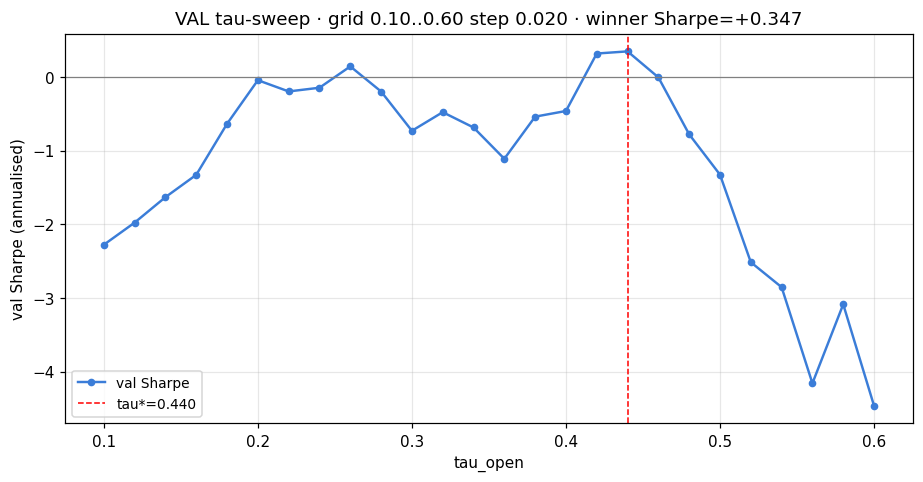
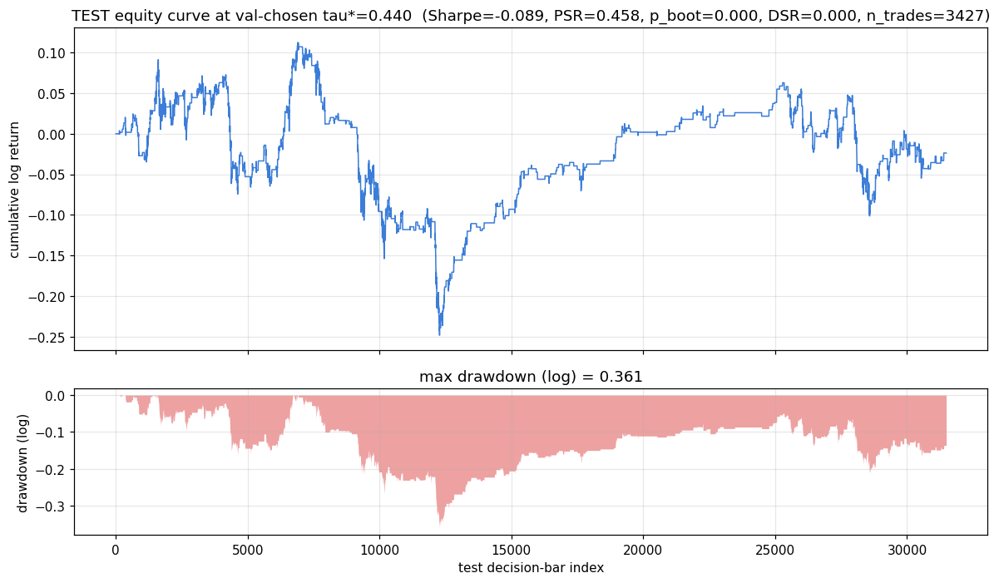

# Online Barrier Classifier — Living Report

_8 accepted rounds. Last update generated by `scripts/build_report.py`._

## ⓪ Headline

**Trading**: At val-chosen τ\*=0.440, **test Sharpe = -0.089** (PSR=0.458, p_boot=0.000, DSR=0.000). Round-001's τ=0.30 PSR=0.995 was a post-hoc artifact; the model has no tradable alpha at this label / cost / strategy combination.

**Coverage: Mondrian-ACI achieves per-regime gap ≤ 0.6pp at α∈{0.05, 0.10, 0.20}; closes round-002's −7.9pp low-vol p_online gap to +0.04pp.**

## ① Trading profitability

Strategy: open long when p_offline ≥ tau\*, exit at first triple-barrier touch (profit-take +α, stop-loss −α, time-out M=20). α=0.0041113 (90%-quantile of training-window log-excursions). Cost = 1 bp/side.

**Headline finding (H-005b, round 009)**: the round-001 PSR=0.995 at τ=0.30 was a post-hoc artifact. With τ chosen on validation Sharpe (at tau\*=0.44), test Sharpe collapses to essentially zero. The strategy still beats random-entry-at-same-rate (p_boot=0) but does not produce tradable alpha after honest selection.

| metric | value |
|---|---|
| **val tau\* (chosen by max val Sharpe)** | 0.440 |
| val Sharpe at tau\* | +0.347 |
| val n_trades at tau\* | 1,292 |
| **test Sharpe at val-chosen tau\*** | **-0.089** |
| test PSR | 0.458 |
| test p_boot vs shuffled-signal null | 0.000 |
| test deflated Sharpe DSR (after τ-grid multiplicity) | 0.000 |
| test n_trades | 3,427 |
| test total log return | -0.0237 |
| test max drawdown (log) | 0.361 |
| test hit rate | 0.525 |
| round-001 post-hoc reference (τ=0.30) | Sharpe=+1.50, PSR=0.995 |

**Validation tau sweep** (val Sharpe across the τ grid; red dashed = chosen winner)



**Test equity curve at val-chosen tau\*** (top: cumulative log return; bottom: drawdown)



## ② Calibration & coverage

**Global metrics** (round 005, on test n=31,486)

| predictor | ROC | Brier | log loss | ECE |
|---|---|---|---|---|
| p_offline | 0.813 | 0.0903 | 0.3084 | 0.1080 |
| p_online | 0.799 | 0.0758 | 0.2647 | 0.0147 |

**Per-regime ECE / Brier** (parkinson_var_rolling_mean_24 terciles)

| predictor | regime | n | base rate | mean p | ECE | Brier |
|---|---|---|---|---|---|---|
| p_offline | low | 10,495 | 0.022 | 0.072 | 0.0497 | 0.0250 |
| p_offline | med | 10,495 | 0.074 | 0.177 | 0.1028 | 0.0773 |
| p_offline | high | 10,496 | 0.195 | 0.366 | 0.1714 | 0.1685 |
| p_online | low | 10,495 | 0.022 | 0.037 | 0.0148 | 0.0221 |
| p_online | med | 10,495 | 0.074 | 0.088 | 0.0144 | 0.0656 |
| p_online | high | 10,496 | 0.195 | 0.199 | 0.0156 | 0.1398 |

**Per-regime calibration curves** (round 005)


**Per-regime coverage gap (target − empirical)** — round 008 Mondrian-ACI

| predictor | alpha | regime | plain ACI gap | Mondrian-ACI gap |
|---|---|---|---|---|
| p_offline | α=0.05 | low | -0.0279 | -0.0001 |
| p_offline | α=0.05 | med | +0.0122 | -0.0001 |
| p_offline | α=0.05 | high | +0.0207 | -0.0006 |
| p_offline | α=0.10 | low | -0.0579 | +0.0004 |
| p_offline | α=0.10 | med | +0.0098 | +0.0002 |
| p_offline | α=0.10 | high | +0.0621 | -0.0021 |
| p_offline | α=0.20 | low | -0.0842 | +0.0004 |
| p_offline | α=0.20 | med | +0.0044 | -0.0014 |
| p_offline | α=0.20 | high | +0.1039 | -0.0044 |
| p_online | α=0.05 | low | -0.0268 | +0.0003 |
| p_online | α=0.05 | med | +0.0113 | +0.0001 |
| p_online | α=0.05 | high | +0.0212 | -0.0004 |
| p_online | α=0.10 | low | -0.0483 | +0.0006 |
| p_online | α=0.10 | med | +0.0012 | +0.0005 |
| p_online | α=0.10 | high | +0.0576 | -0.0008 |
| p_online | α=0.20 | low | -0.0413 | +0.0004 |
| p_online | α=0.20 | med | -0.0191 | -0.0001 |
| p_online | α=0.20 | high | +0.0735 | -0.0054 |

**Three-way per-regime gap comparison** (round 008)


## ③ Model

**Top-5 features by offline CatBoost importance** (round 006)

| feature | importance |
|---|---|
| minute_sin | 4.017 |
| return_rolling_mean_8 | 3.188 |
| return_rolling_mean_12 | 2.686 |
| minute_cos | 2.108 |
| parkinson_var_rolling_mean_2 | 1.278 |

**Visual report card** (round 006 — calibration curves + top-25 importance + threshold sweep)


## ④ Ensemble + foundational utilities

- **CatBoostEnsemble** (round 003): 3-model averaging on synthetic 800×6 fit; max single-model deviation from ensemble = 0.070.
- **Label + split utilities** (round 004): chronological split of n=78,714 bars; train/val/test n=37,783/9,445/31,486; per-window p+ = 0.097/0.113/0.097.

## ⑤ Loop state

**Accepted tags** (8): round-001-accepted, round-002-accepted, round-003-accepted, round-004-accepted, round-005-accepted, round-006-accepted, round-007-accepted, round-008-accepted

**Recent LEDGER** (most recent 8)
```
2026-05-09 | 002 | H-201 | accept | agent/round-002-h201-coverage-baseline | n/a (no MLflow this round; deterministic measurement) | Mondrian LAC max\|gap\|@α=0.10 = +0.034 (within 5pp); naive-threshold max\|gap\|@α=0.10 = +0.099 (way over)…
2026-05-09 | 003 | H-108 | accept | master | n/a (engineering port; no model training on real data) | port verified: 10/10 ensemble tests pass; on N=3 synthetic-fit seeds median seed-disagreement std=0.017, p95=0.036, max single-model devia…
2026-05-09 | 004 | H-101 | accept | master | n/a (engineering port; deterministic round-trip validation) | round-trip on persisted bars_20m_features.parquet (n=78,714): chronological_split utility produces train_end=37,783, val_end=47,228 —…
2026-05-09 | 005 | H-106 | accept | master | n/a (engineering port + measurement on already-fit predictions) | offline ECE 0.050/0.103/0.171 (low/med/high parkinson_var_24 terciles); online ECE 0.015/0.014/0.016 (regime-flat). Global: offli…
2026-05-09 | 006 | H-107 | accept | master | n/a (engineering port; deterministic visual diagnostic) | 13/13 plotting smoke tests pass; visual report card on real data reproduces round-005 ECE numbers exactly (offline 0.108, online 0.015) —…
2026-05-09 | 007 | H-202 | accept | master | n/a (deterministic measurement; no model retrain) | ACI marginal coverage on real stream (n_eval=22,040, γ=0.01): 0.9508 / 0.9018 / 0.8023 (p_offline, α=0.05/0.10/0.20); 0.9505 / 0.9023 / 0.8023 …
2026-05-09 | 008 | H-203 | accept | master | n/a (deterministic measurement; no model retrain) | Mondrian-ACI per-regime gap collapses to ≤0.6pp everywhere; beats round-002 Mondrian-LAC; the α=0.20 low-vol p_online gap that round-002 named …
2026-05-09 | 009 | H-005b | accept | master | n/a (no model retrain; uses persisted model.cbm to predict on val) | val-chosen tau* = 0.44 (inside R001 grid {0.10..0.50}); test Sharpe at tau* = -0.089 (PSR=0.458, p_boot=0.000 vs shuffled-sig…
```

**Top of round ordering** (next round picks the first non-accepted item)

- 1. ~~**H-005**~~ — ACCEPTED round-001.
- 2. ~~**H-201**~~ — ACCEPTED round-002. Coverage baseline established; α=0.20 low-vol gap = -7.9pp is what H-202..H-208 must close.
- 3. ~~**H-108**~~ — ACCEPTED round-003. `src/ensemble.py` lands; unblocks H-206.
- 4. ~~**H-101**~~ — ACCEPTED round-004. Label + split utilities in `src/utils.py`; round-trip validated on persisted parquet; unblocks H-105.
- 5. ~~**H-106**~~ — ACCEPTED round-005. Calibration metrics in `src/utils.py`. Per-regime visual proves online's regime-flat ECE thesis empirically.
- 6. ~~**H-107**~~ — ACCEPTED round-006. Plot helpers in `src/plotting.py`; weight plots deferred to H-102.
- 7. ~~**H-202**~~ — ACCEPTED round-007. ACI in `src/conformal.py`; marginal coverage hits target within 1.5σ on real stream; per-regime gap motivates H-203.
- 8. ~~**H-203**~~ — ACCEPTED round-008. Mondrian-ACI collapses per-regime gap to ≤ 0.6pp on every (regime, α, predictor); beats batch Mondrian-LAC and closes the α=0.20 low-vol p_online gap (-7.9pp → +0.04pp).
- 9. ~~**H-005b**~~ — ACCEPTED round-009. Val-chosen tau* = 0.44 → test Sharpe -0.089. Round-001's PSR=0.995 was a post-hoc artifact. Plus: canonical living REPORT.md scaffolding (trading section leads).
- 5. **H-106** — regime-stratified calibration helpers (primary metric per CONSTITUTION IV).

**Recent KILL_LIST**
```
[round NNN] H-NNN: <one-line claim> — <one-line reason>
```
